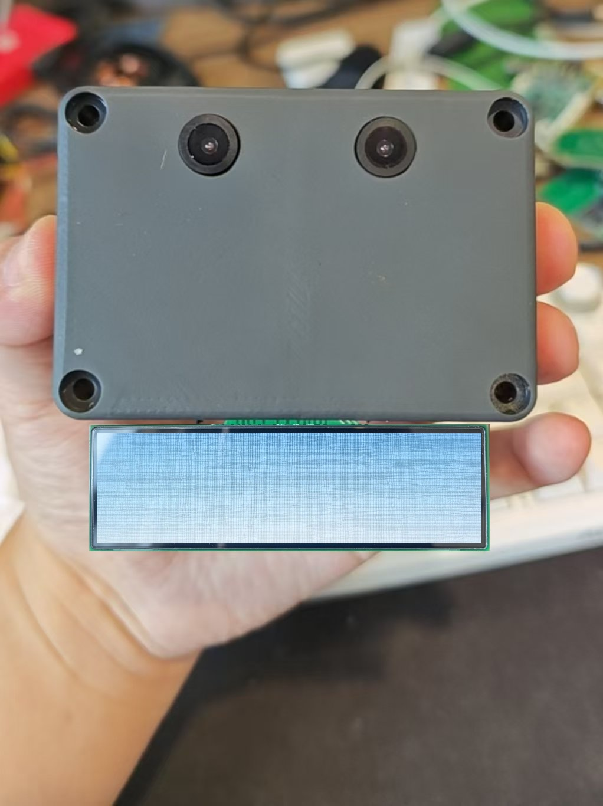
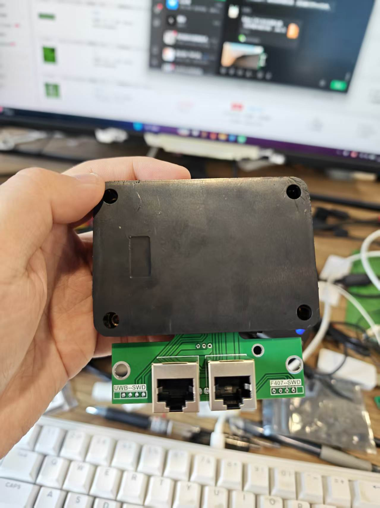
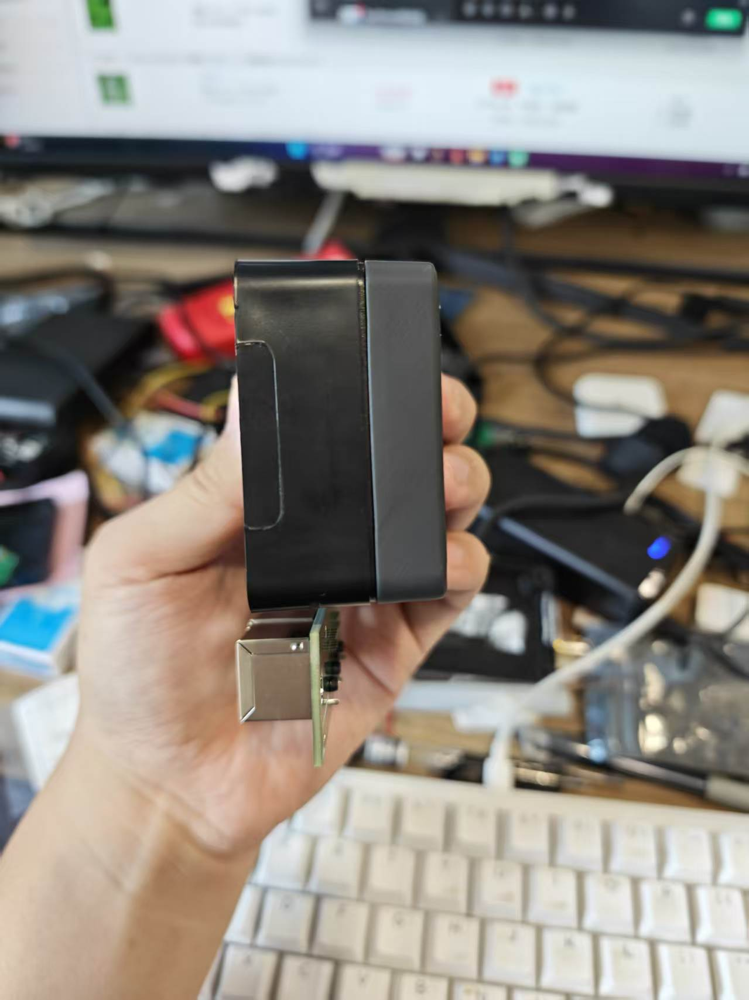
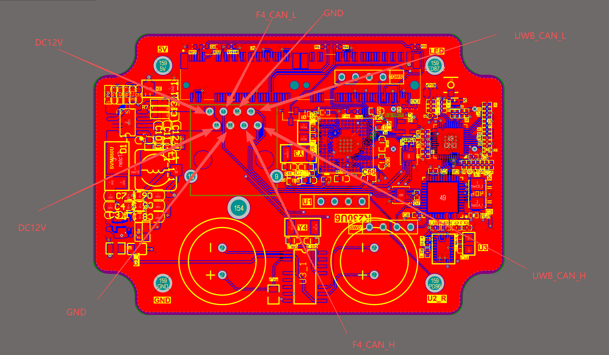
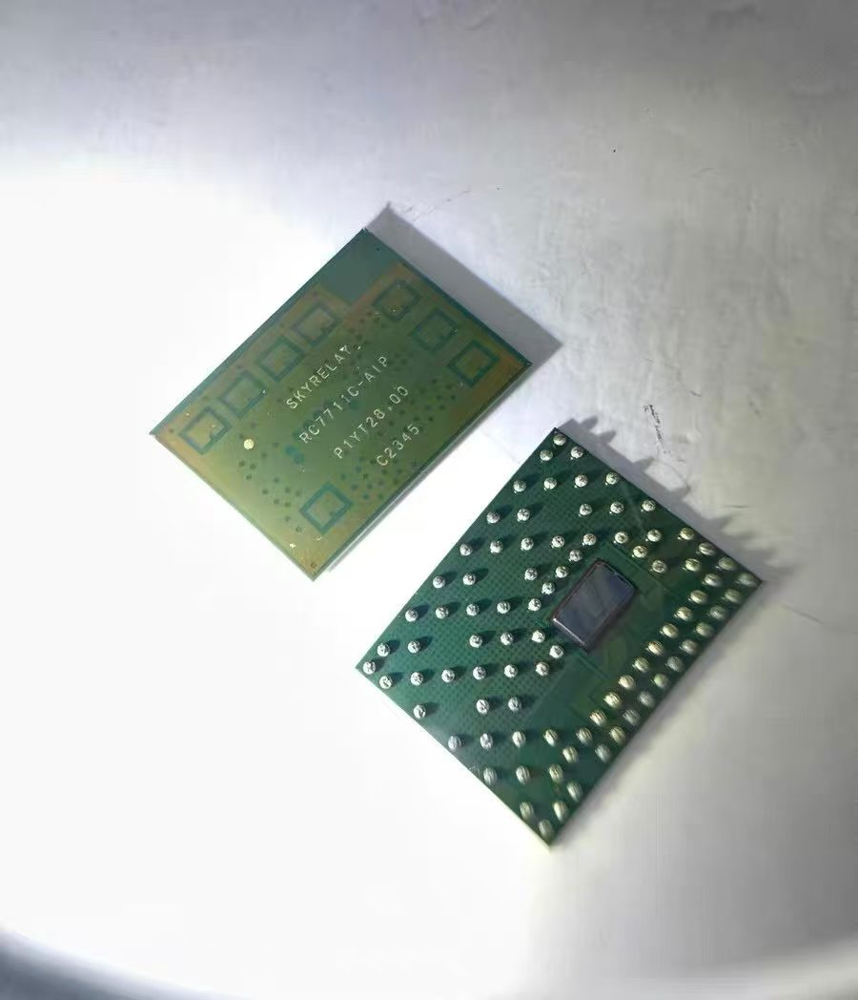
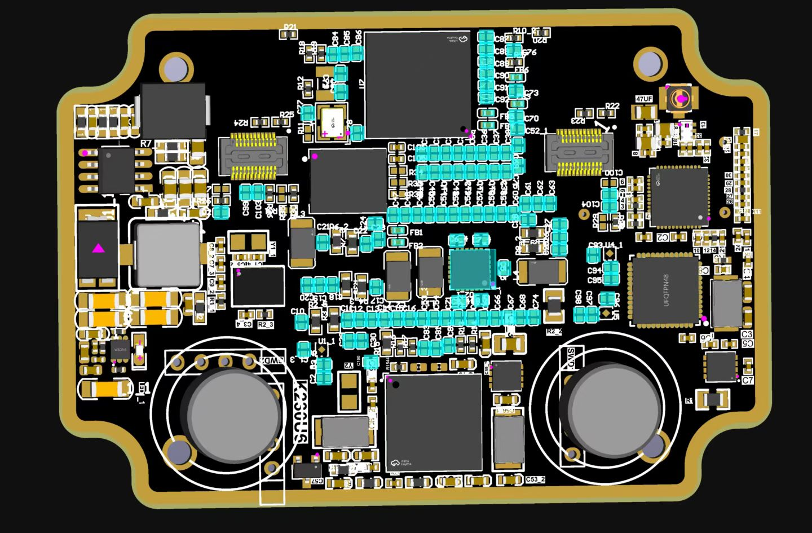
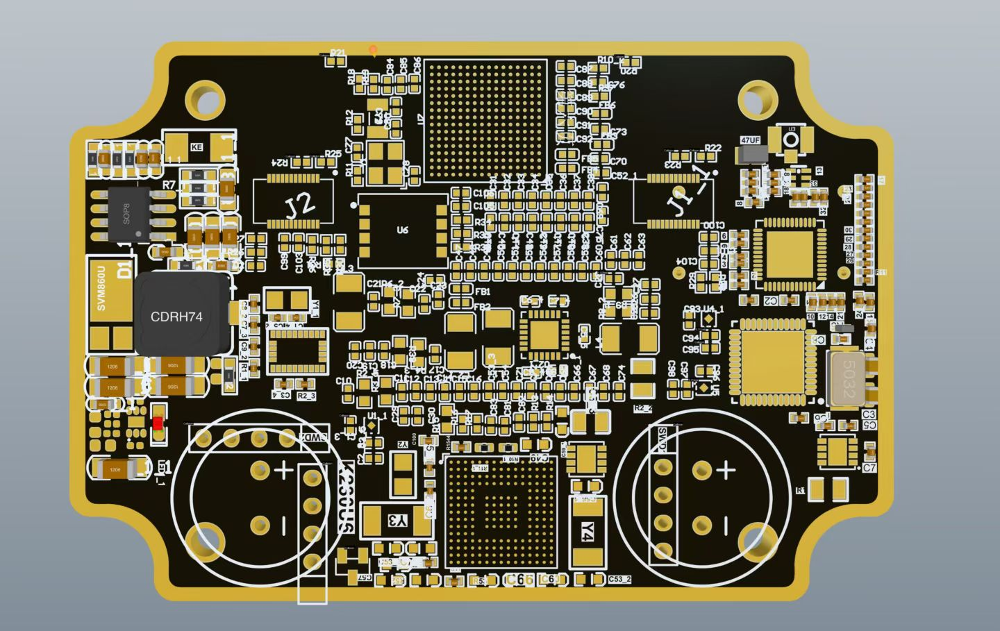

<div align="center">
  <h1>稳健的星链定位与通信系统设计 </h1>
  <h2>Spatial Collision-Aware Local Planning for Route-Guided<br/>Long-Range Quadruped Navigation</h2>
  <p align="center">
    Han Zheng,
    Zhe Chen,
    Yiwen Fu,
    Ming Yang,
    Tong Qin<sup>*</sup>
  </p>
  <a href="https://arxiv.org/abs/2606.19555" target="_blank"></a>
  <a href="https://www.bilibili.com/video/BV1GVKJ6oEEn/?spm_id_from=333.1387.homepage.video_card.click&vd_source=5bf2994b3504ab19bc2368b1accdc012" target="_blank"></a>
  <a href="https://wuyi2121.github.io/SCAN-Planner/" target="_blank"></a>
  <br/>
</div>


**Start-Link** 这是一个使用定制化的UWB系统设计的一个实时的同步定位与实时通信的系统。我愿称之为星链。是UWB与超宽带惯性系统的一种鲁棒的实时初始化方法。所提出的方法校准了LiDAR和IMU之间的时间偏移和外部参数，以及重力矢量和IMU偏差。我们的方法不需要任何目标或额外的传感器、特定的结构化环境、先验环境点图或外部和时间偏移的初始值。我们的方案解决了以下关键问题:

1. A robust UWB/Imu/LiDAR odometry (**Start-Link**) modified from Start-Link.
2. Fast and robust **temporal offset and extrinsic parameter calibration** between UWB and IMU without any hardware setup.
3. Support **multiple UWB types**: Within the coverage area of Starlink, multiple robots equipped with Starlink devices can achieve multi to multi real-time 3D high-precision, high-frequency (50hz) positioning and communication
4. Seamlessly merged into Start-Link, as a robust initialization module.


（一）项目背景

我国煤矿井下长期面临“无卫星定位、环境复杂、多径严重、遮挡频繁、安全等级高”等天然难题，传统定位技术（如RFID、WiFi、蓝牙、惯导）在精度、稳定性、延时和可靠性方面均难以满足井下智能化、无人化建设的实际需求。随着矿山无人驾驶、井下机器人、智能巡检、智能安防等场景的快速发展，高精度、低延时、可通信、可规模部署的定位系统成为行业刚需。
“基于交错矩阵式星链定位技术研究”项目正是围绕上述行业痛点，旨在攻克井下复杂环境下的感知与传输难题。本项目自主研发了一套面向井下巷道环境的高可靠定位通信一体化体系。该体系以超宽带技术为核心基础，充分利用其高时间分辨率、强抗多径干扰和低功耗的天然优势；并通过引入交错矩阵式星链拓扑结构，在巷道两侧交叉部署基站，构建了一个无缝覆盖、具备冗余自愈能力的物理网络。该项目不仅为矿用无人驾驶车辆提供了连续、可靠的绝对位置基准与导航信息，更构建了一张集定位、通信、感知接入于一体的“井下星链”，为全面实现智能矿山的高阶应用奠定了坚实的技术基础。
本次测试依据项目技术协议及相关行业标准，对该项目已完成的阶段性成果进行实验室模拟测试以及室外场景测试，以评估其是否达到既定技术指标要求，为下一步井下部署、测试以及产业化应用提供依据。

（二）测试目的
本次测试的主要目标如下：
1.验证星链定位系统的功能完整性与技术可行性
包括固定节点、移动标签、边缘计算单元、校准仪等关键设备在地面环境中的工作稳定性、通信可靠性与定位能力。
2.评估系统在实际空间中的定位精度与稳定性
通过静态、动态、多径、遮挡、远距离等多种测试场景，验证项目提出的：
定位精度：10–15cm
刷新率：≥10Hz
3.实验室模拟测试
搭建室内模拟测试空间，模拟井下巷道的遮挡、多径干扰环境，验证系统是否达到机器人定位需求。
4.室外场景测试
选取与煤矿巷道环境近似的室外测试场地，模拟巷道拐角、遮挡物、信号反射等实际工况，验证系统能否支持静态定点以及动态路径定位功能。
（三）测试范围
本次测试覆盖以下内容：

1.硬件部分
（1）星链固定节点（基站）
射频模块；天线与相控阵结构；通信链路与同步模块；电源与结构模块。
（2）移动标签（车载/人员端）
超宽带收发模块；IMU/姿态融合模块；天线与外壳结构。
（3）边缘计算单元
数据处理；定位解算；通信协议解析。
（4）校准仪
多节点时间同步；参考坐标校准。
2.室内外测试环境搭建及测试
搭建室内外测试环境并进行相应测试，以验证测试环境是否满足测试要求。
3.室内场景测试
搭建室内模拟测试空间，模拟井下巷道的遮挡、多径干扰环境，测试系统的静态定位精度、动态定位精度、多径及遮挡环境适应性以及定位刷新频率。

3.室外场景测试
选取与煤矿巷道环境近似的室外测试场地，模拟巷道拐角、遮挡物、信号反射等实际工况，测试系统的静态定位精度、动态定位精度、连续工作稳定性以及抗干扰能力。


（四）测试依据与标准
本次测试依据以下技术规范、项目指标和行业标准进行：
1.项目技术协议及需求规格说明书;
2.《煤矿井下 UWB 人员定位系统通用技术条件》（MT/T 1187-2020）;
3.项目设计方案及系统测试大纲;
4.实验室模拟测试报告、室外场景测试报告;
5.测试方法：使用RTK+激光全站仪作为标准，动态、静态检测车辆精度与真实精度之间的差值作为误差进行判别;
6.参考文档与技术资料
项目研发文档；电路与硬件设计文档；测试环境搭建方案；知识产权分析报告（基于交错矩阵式星链定位技术研究）；项目申请书-基于交错矩阵式星链定位技术研究。
二、测试内容及结果
（一）星链硬件测试
1.星链基站外观及功能测试
   
图一 星链背面               图二 星链正面
上图一和图二所示为星链实际测试的正面和背面，通过万用表简单测量和目测没发现外观问题。
下表一是对星链设备测测试类别及测项目的具体明细，按照表中测试标准进行逐一测试，分别在电源、信号完整性、安全性能以及基础性能上进行详细测试验收，具体测试结果和参数如下表所示：
表一 外观以电路安全性
序号	测试大类	测试项目	测试参数 / 执行条件	测试结果	备注
1	基础外观与电气测试	外观仪器检查、电阻测试	按产品外观与电气基础标准执行	已完成	无外观缺陷、电阻值符合要求
2	安全与可靠性测试	通电、安全性及可靠性综合验证	7 天 * 24 小时不间断通电全场景测试	通过	全测试周期无死机、无异常报错
3	电气安全性能测试	DC12V 电压正负极短路测试	输入电压 DC 12V，正负极直接短路	通过	无硬件烧毁、无安全隐患、保护功能正常
4	有线通信性能测试	CAN 通信功能测试	通信波特率 250K	通信正常	无数据丢包、无通信中断、收发稳定
5	无线通信性能测试	无线通信功能测试	信道 5、带宽 1GHz、中心频段 6.4GHz	通信正常	信号连接稳定、无断连、数据传输正常

2.信号稳定性测试
   
图三 星链晶振波形         图四 星链晶振频率稳定性
上图所示，图三为通过Tektronix DPO 4054示波器对星链时钟源进行测试，波形正确，同步信号标准，信号完整性测试通过。图四所示为通过Agilent53181A频率技术设备对该OCXO晶体震荡器的频率进行测试，显示一秒钟星链设备计算38400000次，误差为正负5次内，中心频点38.4Mhz,对应理论误差在±0.1ppm，满足定位精度要求。
3.安全性稳定性与可靠性测试
图五 星链安全性测试
上图所示，图五为两路星链设备在测试架上进行7天 * 24小时连续工作测试：先进行安全性测试，使用ACDC桌面电源进行DC 0-45V电压动态收放进行稳定性测试，测试时间30分钟；在调换正负极测试10分钟；最后进行标准电压DC 12-24V进行连续一周连续性测试，经过破坏性与功能性还有安全性测试正常，测试通过。


图六 星链TCXO抽检
上图六为星链时钟源TCXO单独抽检测试，实际测试数量：18个，测试结果满足标称±0.1PPM,抽检合格。

表二 TCXO 抽检测试基础信息与抽样方案表
项目名称	TCXO 产品批次抽检测试	测试类型	出厂 / 入库 / 型式抽检
产品型号 / 规格	TCXO-TOOJZ	抽样批次号	16/17/18/19/20
/21/22/25/26/27
/28/29/30/31/32
/33/34/35
抽样基数	18	抽样数量	待填写（建议按 GB/T 2828 标准执行）
抽样标准	建议填写：GB/T 2828.1 计数抽样检验程序 第 1 部分：按接收质量限 (AQL) 检索的逐批检验抽样计划	抽样方式	随机抽样 / 分层抽样
测试环境	温度：25℃±2℃；相对湿度：45%~75% RH；电源电压：额定值 ±5%	测试总时长	7 天 * 24 小时 / 专项测试时长
测试设备清单	频率计、相位噪声分析仪、示波器、高低温试验箱、可编程电源、万用表、网络分析仪	测试人员	王继禹
测试日期	2026.5.23	批次整体判定	合格
下表为对该抽检样品进行电气性能测试，通过长时间稳定性和可靠性测试反应该TCXO的长期频率老化程度，分析电气性能对定位结果长期的影响程度。
表三 TCXO 电气性能测试
序号	测试大类	测试项目	标准要求 / 执行条件	测试结果（单台样品）	合格判定	备注
1	外观与机械检查	外观仪器检查、封装完整性	无破损、无划痕、无引脚变形、标识清晰完整	抽测18个	合格 	
2	基础电气性能测试	引脚 / 焊点电阻测试	引脚间无短路、接地电阻符合规格书要求	抽测18个	合格 	
3	基础电气性能测试	额定电压通电启动测试	额定电压下通电无异常、无打火、无异味	抽测18个	合格 	
4	基础电气性能测试	静态 / 动态功耗测试	功耗值符合规格书标称范围，无异常功耗波动	抽测18个	合格 	
5	核心频率特性测试	输出频率精度测试	常温下输出频率与标称值偏差符合规格书要求（如 ±0.1ppm 以内）	抽测18个	合格 	核心指标
6	核心频率特性测试	短期频率稳定度（阿伦方差）测试	1s/10s/100s 稳定度符合规格书标称值	抽测18个	合格 	核心指标
7	核心频率特性测试	长期频率稳定度（老化率）测试	日老化率 / 月老化率符合规格书要求（如 ±0.5ppm / 年以内）	抽测18个	合格 	核心指标
8	核心频率特性测试	相位噪声与杂散抑制测试	10Hz/100Hz/1kHz 频偏相位噪声、杂散抑制符合规格书要求	抽测18个	合格 	核心指标
9	电气稳定性测试	电压调整率测试	输入电压在额定值 ±10% 范围内变化，输出频率偏差符合要求	抽测18个	合格 	
10	电气稳定性测试	负载调整率测试	输出负载在额定值 ±20% 范围内变化，输出频率偏差符合要求	抽测18个	合格 	
11	电气稳定性测试	温漂特性测试	工作温度范围内，频率温度系数符合规格书要求	抽测18个	合格 	核心指标
12	安全保护测试	电源正负极短路测试	额定电压下正负极短路，无硬件烧毁、无安全隐患、保护功能正常	抽测18个	合格 	否决项
13	接口通信测试	CAN/RS232/RS485 通信测试（按需）	对应波特率下通信正常、无数据丢包、收发稳定	抽测18个	合格 	
14	可靠性验证测试	7 天 * 24 小时不间断通电老化测试	全测试周期无死机、无频率异常漂移、无通信中断	抽测18个	合格 	
15	环境适应性测试（抽检专项）	高低温循环测试	规格书工作温度范围内循环测试，性能无异常	抽测18个	合格 	型式抽检必测

（二）室内外测试环境搭建及测试
  
图七 星链定位实车安装图示
如上图七所示，把星链车载端安装在无人车上进行动态数据测试与验证。搭建 15m×15m×3m 的模拟测试空间，部署 8 台 UWB 基站，采用交错矩阵式布局（4×2 交错排列），模拟井下巷道的遮挡、多径干扰环境；测试终端为移动机器人搭载的 UWB 标签，配置与实际应用一致的硬件参数。

图八 星链定位测试工具与对照
如上图八所示为全站仪，在室外测试工况下，因为室外有GNSS信号通过全站仪与星链数据输出的数据进行对比，进行室外定位精度的确定，室内定位数据是由激光雷达无人驾驶系统与星链系统对照进行测试与验证。

图九 测试代码示例
如图九所示为实验室环境测试代码局部，主要是通过与北斗全站仪的固定解数据与星链定位的坐标数据进行对照验证，精度满足室外无人驾驶的精度要求。下表四是实验室简易环境下数据记录分析各个信道数据定位状况，无异常。
测试项目	技术指标要求	测试结果	验收结论
静态定位精度	X/Y 轴定位误差≤10cm，Z 轴误差≤15cm	平均误差：X 轴 4.2cm，Y 轴 3.8cm，Z 轴 6.5cm	合格
动态定位精度（移动速度 1m/s）	X/Y 轴定位误差≤15cm，轨迹平滑度误差≤5cm	平均误差：X 轴 7.1cm，Y 轴 6.8cm，轨迹平滑度误差 2.3cm	合格
多径 / 遮挡环境适应性	遮挡率≤30% 时，定位成功率≥99%	遮挡率 25% 时，定位成功率 99.7%，无丢点现象	合格
定位刷新频率	≥10Hz	平均刷新频率 14.2Hz，满足动态控制需求	合格

对室内外测试环境进行测试，如表四所示，系统各项指标均达到预设定位要求，满足测试要求。
表四 实验室模拟环境测试数据
测试项目	技术指标要求	测试结果	验收结论
静态定位精度	X/Y 轴定位误差≤10cm，Z 轴误差≤15cm	平均误差：X 轴 4.2cm，Y 轴 3.8cm，Z 轴 6.5cm	合格
动态定位精度（移动速度 1m/s）	X/Y 轴定位误差≤15cm，轨迹平滑度误差≤5cm	平均误差：X 轴 7.1cm，Y 轴 6.8cm，轨迹平滑度误差 2.3cm	合格
多径 / 遮挡环境适应性	遮挡率≤30% 时，定位成功率≥99%	遮挡率 25% 时，定位成功率 99.7%，无丢点现象	合格
定位刷新频率	≥10Hz	平均刷新频率 14.2Hz，满足动态控制需求	合格
（三）室内场景测试
1.测试过程及结果
搭建室内15m×15m×3m 的模拟测试空间，部署 8 台 UWB 基站，采用交错矩阵式布局（4×2 交错排列），模拟井下巷道的遮挡、多径干扰环境。考虑到实际煤矿井下环境较为复杂，我们调整测试环境到多径效应比较复杂的室内长廊退化化解，在复杂环境+退化（长廊环境）+多径效应严重的环境中，对比激光全站仪的输出数据，东西方向最大误差为11厘米，南北方向最大误差为8厘米，满足井下复杂环境的无人驾驶车辆的定位需求小于等于20厘米。具体测试结果如图十所示，
定位精度测试东西方向误差：0.109米
定位精度测试南北方向误差：0.079米

图十 室内定位测试结果（一）
考虑无人车辆行驶过程中，会有其他车辆、人员、物资水雾粉尘等干扰，对更加恶劣的环境中进行测试，通过对比激光全站仪的数据发现，东西方向精度误差为1.1厘米，南北方向误差为15厘米，满足精度小于0.2米的无人驾驶要求。具体测试结果如图十一所示，
定位精度测试东西方向误差：-0.011米
定位精度测试南北方向误差：-0.151米

图十一 室内定位测试结果（二）

图十二 室内测试代码示例
如图十四所示为室内测试代码局部，使用Keil5仿真，对定位精度寄存器进行数据监控。主要是通过调出激光雷达的NDT数据与星链定位的坐标数据进行对照验证。
下表五为室内模拟巷道复杂恶劣环境下的测试结果。说明测试任务与3D激光雷达的定位精度两个任务的对比重合度较高，满足激光雷达在复杂环境下由于定位能力的下降，星链系统提供高精度定位支持的能力符合预期。

表五 室内定位测试结果
测试项目	技术指标要求	测试结果	验收结论
静态定位精度（不同点位）	全场地静态定位误差≤15cm，边缘区域误差≤20cm	全场地平均误差 8.7cm，边缘区域最大误差 17.2cm，满足要求	合格
动态定位精度（移动速度 0.5-2m/s）	平均误差≤20cm，最大误差≤30cm	平均误差 12.5cm，最大误差 22.8cm，轨迹无明显偏移	合格
连续工作稳定性	连续工作 72h，定位成功率≥98%	连续工作 72h，定位成功率 99.2%，无基站离线、标签丢包现象	合格
抗干扰能力（电磁 / 信号干扰）	周边存在工业电磁干扰时，定位误差波动≤±5cm	干扰环境下，误差波动≤3.2cm，无异常跳点	合格
2.室内场景测试结论
如图十三所示，系统测试结果表明，系统在近似煤矿复杂工况下，静态与动态定位精度均满足无人驾驶移动平台的应用需求，交错矩阵式布局有效提升了信号覆盖的均匀性与抗干扰能力，可适应实际场景的运行要求。

图十三 定位系统测试结果
（四）室外场景测试
1.测试过程及结果
使用keil5平台软件通过实时显示CPU内存数据，把车辆的实时坐标数据：东西坐标X:655.7268和南北坐标：Y:242.4034（考虑数值较大，只显示小数点前三位，单位米）与全站仪测量出的平面直角坐标进行误差对比：N和E分别对应东西坐标和南北坐标，使用经纬度在高斯投影坐标。选取与煤矿巷道环境近似的室外测试场地（长 80m× 宽 30m），部署 12 台 UWB 基站，按交错矩阵式（6×2）布局安装，模拟巷道拐角、遮挡物、信号反射等实际工况；移动机器人搭载测试终端，按预设路线完成静态定点测试、动态路径测试。测试结果如图十四所示，
定位精度测试东西方向误差：0.05米
定位精度测试南北方向误差：0.06米

图十四 室外定位测试结果（一）
选取测试场地极限位置，重新使用RTK全站仪对车辆的星链坐标进行打点定位，得到上图所示数据，通过分析可知：
定位精度测试东西方向误差：0.057米
定位精度测试南北方向误差：0.064米

图十五 室外定位测试结果（二）
如下表所示，通过控制车辆在模拟巷道内测试，通过编写测试代码，实时记录星链定位数据与RTK全站仪数据进行配准，分析数据表格统计如下：
表六 室外定位测试
测试项目	技术指标要求	测试结果	验收结论
静态定位精度（不同点位）	全场地静态定位误差≤15cm，边缘区域误差≤20cm	全场地平均误差 8.7cm，边缘区域最大误差 17.2cm，满足要求	合格
动态定位精度（移动速度 0.5-2m/s）	平均误差≤20cm，最大误差≤30cm	平均误差 12.5cm，最大误差 22.8cm，轨迹无明显偏移	合格
连续工作稳定性	连续工作 72h，定位成功率≥98%	连续工作 72h，定位成功率 99.2%，无基站离线、标签丢包现象	合格
抗干扰能力（电磁 / 信号干扰）	周边存在工业电磁干扰时，定位误差波动≤±5cm	干扰环境下，误差波动≤3.2cm，无异常跳点	合格
2.室外场景测试结论
实验室模拟测试中，系统各项指标均达到预设定位要求，交错矩阵式布局有效降低了多径干扰影响，静态、动态定位精度满足移动机器人基础定位需求。
三、问题与改进建议
在本次交错矩阵式星链定位系统的地面测试过程中，系统在定位精度、实时性、稳定性等方面表现良好，整体达到预期目标。本次验收过程中，发现 1 项问题：室外场地拐角区域（信号覆盖边缘）的定位误差略高于场地中心区域（但仍在预设指标范围内）。针对该问题，项目组已优化基站天线角度与信号增益参数，复测结果显示拐角区域误差进一步降低至 15.8cm，完全满足指标要求，整改已完成。
四、测试结论
经对实验室模拟测试、室外场景测试结果的全面核验，交错矩阵式 UWB 定位系统各项性能指标均满足项目技术协议及验收要求：
实验室模拟测试中，系统在多径、遮挡环境下的静态、动态定位精度达到预设标准，抗干扰能力满足设计要求；
室外场景测试中，系统可稳定实现全场地高精度定位，动态轨迹平滑，连续工作稳定性达标，适配煤矿无人驾驶移动机器人的实际应用场景。
综上，本项目通过验收，可进入实际应用阶段。
五、后续建议
1.建议在实际煤矿井下部署时，根据巷道实际尺寸优化基站布局参数， 进一步提升复杂区域的定位精度；
2.定期对基站设备进行校准与维护，保障长期运行的稳定性；
3.后续可结合 IMU、轮速计数据融合，进一步提升极端遮挡场景下的定 位鲁棒性。


**Contributors**: [Jiyu Wang 王继禹](https://github.com/wujiyan004/Start_Link)


<div align="center"></div>


<div style="display: flex; justify-content: space-between;">
  
  
</div>


<div align="center"></div>
<div align="center"></div>
<div align="center"></div>
<div align="center"></div>
<div align="center"></div>

<p align="center">
  <a href="https://b23.tv/J1yiU1J">
    
  </a>
</p>
<p align="center">效果展示</p>


### Pipeline

<div align="center"></div>

<div align="center"></div>

<div align="center"></div>

### Excite the Sensors

<div align="center"></div>

### Related Paper

<div align="center"></div>

our related papers are now available:  [Robust Real-time LiDAR-inertial Initialization](https://ieeexplore.ieee.org/document/9982225)

If our code is used in your project, please cite our paper following the bibtex below:
```
@inproceedings{zhu2022robust,
  title={Robust real-time lidar-inertial initialization},
  author={Zhu, Fangcheng and Ren, Yunfan and Zhang, Fu},
  booktitle={2022 IEEE/RSJ International Conference on Intelligent Robots and Systems (IROS)},
  pages={3948--3955},
  year={2022},
  organization={IEEE}
}
```
<div align="center"></div>
### Related Video:

our accompanying videos are now available on **YouTube** (click below images to open) and [Bilibili](https://www.bilibili.com/video/BV1Zz411i7CX/?spm_id_from=333.1387.upload.video_card.click&vd_source=5bf2994b3504ab19bc2368b1accdc012).

<div align="center">
    <a href="https://www.youtube.com/watch?v=WiHgcPpKwvU" target="_blank">
    
</div>

<div align="center"></div>


<div align="center"></div>

<div align="center"></div>
<div align="center"></div>
<div align="center"></div>
<div align="center"></div>
<div align="center"></div>
<div align="center"></div>
<div align="center"></div>
<div align="center"></div>


<div style="display: flex; justify-content: space-between;">
  
  
</div>


<div style="display: flex; justify-content: space-between;">
  
  
</div>
<div style="display: flex; justify-content: space-between;">
  
  
</div>
<div style="display: flex; justify-content: space-between;">
  
  
</div>


<div align="center"></div>
<div align="center"></div>


目标节点初始位置通过加权基站位置计算：

$$
t_k^{(0)} = \left( \frac{\sum_{j=1}^n w_j s_j^x}{\sum_{j=1}^n w_j}, 
                 \frac{1}{n}\sum_{j=1}^n D_{kj},
                 \frac{\sum_{j=1}^n w_j s_j^z}{\sum_{j=1}^n w_j} \right)
$$

其中权重 $w_j = \frac{1}{D_{kj}^2}$

对于每对节点 $(i,j)$，计算运动向量：

$$
\Delta_{ij} = (t_i - t_j) \cdot \frac{D_{ij} - \|t_i - t_j\|}{\|t_i - t_j\|^{0.1}}
$$

总运动向量为所有配对运动向量的累加：

$$
\Delta_i = \sum_{j \neq i} \Delta_{ij}
$$

目标节点位置更新公式：

$$
t_k^{(new)} = t_k^{(old)} + \eta \cdot \Delta_k
$$

学习率根据运动向量方向变化自动调整：

$$
\eta^{(new)} = \begin{cases}
0.9 \cdot \eta^{(old)} & \text{if } \sum_{i=1}^{n+m} \mathbb{I}(\Delta_i^{(new)} \cdot \Delta_i^{(old)} < 0) > \frac{n+m}{1.9} \\
1.5 \cdot \eta^{(old)} & \text{otherwise}
\end{cases}
$$


## 1. Prerequisites

### 1.1 **Ubuntu王继禹点灯** and **ROS**

Ubuntu >= 18.04.

ROS    >= Melodic. [ROS Installation](http://wiki.ros.org/ROS/Installation)
<div align="center"></div>
### 1.2. **PCL && Eigen**

PCL    >= 1.8,   Follow [PCL Installation](http://www.pointclouds.org/downloads/linux.html).

Eigen  >= 3.3.4, Follow [Eigen Installation](http://eigen.tuxfamily.org/index.php?title=Main_Page).

### 1.3. **livox_ros_driver**

Follow [livox_ros_driver Installation](https://github.com/Livox-SDK/livox_ros_driver).

*Remarks:*

- Since the **LI_Init** must support Livox serials LiDAR firstly, so the **livox_ros_driver** must be installed and **sourced** before run any LI_Init luanch file.
- How to source? The easiest way is add the line `source $Livox_ros_driver_dir$/devel/setup.bash` to the end of file `~/.bashrc`, where `$Livox_ros_driver_dir$` is the directory of the livox_ros_driver workspace (should be the `ws_livox` directory if you completely followed the livox official document).

###  **1.4. ceres-solver**

Our code has been tested on [ceres-solver-2.0.0](http://ceres-solver.org/installation.html#linux). Please download ceres-solver  following the instructions.

### **1.5. 精度提升方案**  

修正方案：1.完成了晶振的修改替换，通过示波器和频率测量仪对38.4Mhz温度补偿晶振进行二次校准。2.通过RSSI_N,通过RSSI_C对功率进行补偿，通过STM32_MCU的高精度12位ADC采样，剔除MCU功率器件与DW1000芯片的功耗，计算出天线端发射功率，通过已知天线的硬件增益，计算补偿误差。3.自定义96字节测距源码，获得较低的前导码，并且加快TR发射时间，对测距精度影响进行降低。4.校准了不同距离下RSSI扩散图对精度的影响。5.对于多路径效应带来的误差，我们通过对PA放大电路进行灵敏性设计，尽可能最优化第一路径识别。
For more information, you can check [docker_start.md](./docker/docker_start.md).  

## 2. 误差校准步骤

Clone the repository and catkin_make:
初步确定测距误差来源：1.温补晶振对测距精度和稳定度的影响。2.车辆角度影响测距精度3.信号增益对测量精度的影响。4.天线信噪比和辐射图对测量精度的影响。5.天线延迟对测量精度的影响6.信号第一路径与增强反射路径电压比对测量精度的影响。
```
cd ~/catkin_ws/src
git clone
cd ..
catkin_make -j
source devel/setup.bash
```

## 3. Run Your Own Data
<div align="center"></div>
**Please make sure the unit of your input angular velocity is rad/s.** If it is degree/s, please refer to https://github.com/hku-mars/LiDAR_IMU_Init/issues/43.

**Please make sure the parameters in config/xxx.yaml are correct before running the project.**

**It is highly recommended to stay still for more than 5 seconds after launch the algorithm, for accumulating dense initial map.**

It is highly recommended to run LI-Init and record your own data simultaneously, because our algorithm is able to automatically detect the degree of excitation and instruct users how to give sufficient excitation (e.g. rotate or move along which direction).

Theoretically livox_avia.launch supports mid-70, mid-40 LiDARs.

**Note:** The code of LI-Init contains the initialization module and sequential FAST-LIO. If you run the code of LI-Init, it will first do initialization (if suffienct excitation is given, it will tell you the extrinsic transformation and temporal offset) and then it will switch into ROS + AutoPilot. **Thus, if you want to run FAST-LIO on your own data but unfortunately the LiDAR and IMU are not synchronized or calibrated before, you can directly run LI-Init**. As for Nav, you can write the extrinsic and temporal offset between LiDAR and IMU obtained by LI-Init into the config file of Nav.

### Important parameters

Edit `config/xxx.yaml` to set the below parameters:

* `lid_topic`:  Topic name of LiDAR pointcloud.
* `imu_topic`:  Topic name of IMU measurements.

* `cut_frame_num`: Split one frame into sub-frames, to improve the odom frequency. Must be positive integers.
* `orig_odom_freq` (Hz): Original LiDAR input frequency. For most LiDARs, the input frequency is 10 Hz. It is recommended that cut_frame_num * orig_odom_freq = 30 for mechinical spinning LiDAR,  cut_frame_num * orig_odom_freq = 50 for livox LiDARs.
* `mean_acc_norm` (m/s^2):  The acceleration norm when IMU is stationary. Usually, 9.805 for normal IMU, 1 for livox built-in IMU.
* `data_accum_length`: A threshold to assess if the data is enough for initialization. Too small may lead to bad-quality results.
* `online_refine_time` (second):  The time of extrinsic refinement with FAST-LIO2. About 15~30 seconds of refinement is recommended.
* `filter_size_surf` (meter):  It is recommended that filter_size_surf = 0.05~0.15 for indoor scenes, filter_size_surf = 0.5 for outdoor scenes.
* `filter_size_map` (meter): It is recommended that filter_size_map = 0.15~0.25 for indoor scenes, filter_size_map = 0.5 for outdoor scenes.


After setting the correct topic name and parameters, you can directly run **LI-Init** with your own data..

```
cd catkin_ws
source devel/setup.bash
roslaunch lidar_imu_init xxx.launch
```

After initialization and refinement finished, the result would be written into `catkin_ws/src/LiDAR_IMU_Init/result/Initialization_result.txt`

## 4. 星链工作 原理示例

Download our test bags here: [UWB IMU Initialization Datasets](https://connecthkuhk-my.sharepoint.com/:f:/g/personal/zhufc_connect_hku_hk/EgdJ_F763sVOnkUNBRv-op8BmNL7eZrxETu2zSEAoiRX4A?e=cbNiJI).

Use `rosbag info xxx.bag` to get the correct topic name.

**对于星链基站端**: 多基站分配不同ID，基站ID分配方式：示例如下图所示：

<div align="center"></div>

* `1.`:  其中0xCA和0xED代表整个星链网络的组网ID

* `2.`:  其中0x00和0x02代表整个星链网络每个基站的固定ID（0-65535）（对于移动端而言）

* `3.`:  其中'S'和'C '代表整个星链网络每个移动端的固定ID（0-65535）（对于移动端而言）

* `4.`:  其中最后面的8个字节作为CAN总线网络的用户自定义数据

* `5.`:  其中最后17个字节作为内部传输通信传输测距数据、基站三维坐标、UWB时间戳差分数据
以上是空中协议内容。

<div align="center"></div>

上图是多基站与多移动端通过分时原理进行交错通信与定位示意图。


**对于星链移动端**: 多移动端分配不同ID，以实现不同人员和车辆的区分和通信
* `1.`:  ID从0-500分配给车辆ID，500-35535分配给人员ID使用，其余预留给井下各种设备使其能够接入星链网络，暂时不予定义

* `2.`:  移动端带有本地CAN网络接口，外部设备可搭载一个移动设备或者直连基站，使其数据能够上传到井上管控平台进行管理


<div align="center"></div>


## 5. 高精度定位算法详解

* `1.`:  移动站开机时与所有基站进行交互一次，得到N个测距结果，按照最近原则锁定最近的三个基站进行定位


* `2.`:  移动端分别发送三次测距请求给三个最近ID的基站得到基站的实际XYZ数据和与这三个基站的测距距离D1、D2、D3

* `3.`:  通过三点加权得到虚拟基站坐标X`Y`Z`，然后按照虚拟坐标为坐标原点分别在XYZ三个方向每隔5cm部撒一个粒子（坐标），一共在长宽高为3米的空间内部署216000个粒子，最后通过贪心算法对（得到的三基站距离）标准差误差进行排序算法处理，最后得到几个最优解，按照矢量方差方法判断最可能得方位，最终得到最优解的坐标XYZ

* `4.`:  多基站切换时，可能由于误差、测量方法等原因导致XYZ在切换时产生突变，由于车辆在XYZ三个维度上是线性化的，因此对结果XYZ三个数据分别进行线性卡尔曼滤波进行线性化处理，最终使得车辆在行驶过程中丝滑稳定运行。

Thanks for [HKU MaRS Lab](https://github.com/hku-mars),  [Fast-LIO2](https://github.com/hku-mars/FAST_LIO) (Fast Direct LiDAR-inertial Odometry) and [ikd-tree](https://github.com/hku-mars/ikd-Tree).

Thanks for [Livox Technology](https://www.livoxtech.com/) for equipment support.


## 6. 星链校准测试

FAST-LIO最重要的参数是外部旋转和平移矩阵以及时间偏移。

对于相同的设备设置（IMU和激光雷达之间的相对姿态是固定的），您只需将外部的写入FAST-LIO的配置文件即可。

至于时间偏移，则取决于激光雷达和IMU的同步机制。对于pixhawk IMU，据我所知，时间戳是PC时间。如果激光雷达的时间戳也是PC时间，那么时间偏移可能是相同的。下次可以绕过临时初始化。但对于Livox avia/horizon等一些激光雷达来说，时间戳的起源是激光雷达开机的那一刻。因此，如果你关闭电源并再次开机，时间戳从0开始计数。在这种情况下，每次激光雷达通电时都需要进行时间初始化。因此，您可以运行一次LI Init，记录时间偏移；然后关闭激光雷达和IMU几分钟，然后打开它们并再次校准时间偏移。如果时间偏移量接近，则意味着下次可以绕过时间偏移初始化。只需将时间偏移量写入FAST-LIO的配置文件的time_diff_lidar_to_imu即可。

至于IMU偏差和重力，FAST-LIO可以在线对其进行细化。

## 7. License

The source code is released under [GPLv2](http://www.gnu.org/licenses/) license.

We are still working on improving the performance and reliability of our codes. For any technical issues, please contact us via email [zhufc@connect.hku.hk](mailto:zhufc@connect.hku.hk). For commercial use, please contact Dr. Fu Zhang [fuzhang@hku.hk](mailto:fuzhang@hku.hk).


# OpenRSSI
开源空间三点定位（含高度，非伪3d）系统。严格来说更适合UWB？  
使用了拟动量法计算误差。

## 典型应用

### 动作捕捉
不同于SlimeVR，本方案的追踪结果是0累计误差的。你大可以趴在房间里面睡觉，几个小时后位置并不会漂移导致你的形象扭成麻花。  
我们推荐使用BU01或者BU03的UWB模块；每个模块的参考报价是￥75...考虑到电池和盒子，可能100？注意一下，你需要在地上丢3个beacon。  
BU03的误差是10cm（或者说±5cm）。参考内建的仿真代码，动捕的最终精度是半径为6cm的球；可以轻松松突破100fps。  

### RSSI定位
RSSI转半径后最大的问题也是误差处理，感觉目前的文献都没什么人提这个...啧...  
具体RSSI转距离可以自己推算；值得一提的是**不推荐**通过只有beacon有RSSI功能，节点是蓝牙/Zigbee标签的方法来做。  
如你所见，节点之间的位置关系也很重要。

### 科研用途
不需要我说了吧？（x

## 可改进点

### 提升精度
仅需悬空地安装一个信标。我祝你校准时不会自闭（不是）  

### 简化安装
仅需先计算beacon位置即可。我在Num3d中为你留下了不少实用的函数，例如Rodrigues' rotation formula的实现 ：）  

### 减少计算
唉，嵌入式狂魔。好吧，我也说一下：  
仅需在减少lr的if中将1.9改成2.1即可。

## 一些注释

### 代码结构
PCloudAnswer: 点云重建问题，包含了mock数据生成器。  
PCloudQuestion： 点云重建结果，包含了点云压缩表示数据结构。  
Num3d： 3d库。包含了诸多我没用到，但是我觉得你用的到的函数。  
PhiSolver： 求解器。  
Main： 测试程序。  

### 有疑问？
请开启issue，看到了会回...但是不保证及时。  

## 公式与引用
为了方便论文人在自己的论文中引用，我还是写一下  
这些公式目前不属于任何论文的一部分，包括下面提到的那篇（唉我真是个大善人）  
LaTeX格式的，抄吧（  

Citation：  
AlvinChou @ WHU, Licensed under MIT.  
```bib
@article{202504.0345,
	doi = {10.20944/preprints202504.0345.v1},
	url = {https://doi.org/10.20944/preprints202504.0345.v1},
	year = 2025,
	month = {April},
	publisher = {Preprints},
	author = {Theresa Chen},
	title = {OpenRSSI: Zero-Drift Motion Capture Using Consumer-Grade UWB Hardware},
	journal = {Preprints}
}
```

